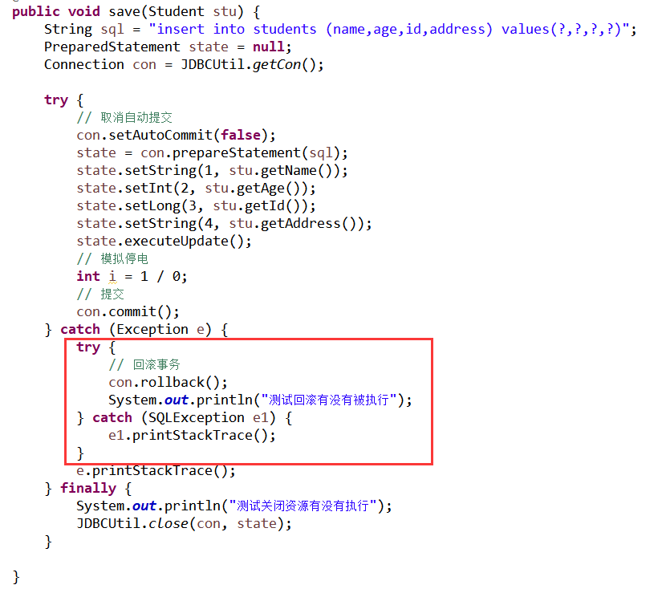
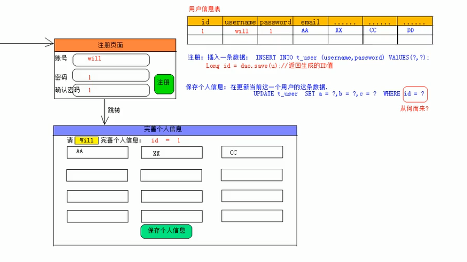

#JDBC

#一.JDBC概述
##1.什么是持久化?
>把内存中的数据保存到可掉电式存储设备中以供以后使用.


##2.Java中,如何访问数据库?
>在java中,只能通过jdbc来访问数据库.

##3.JDBC访问数据库的形式
>直接使用JDBC的API去访问数据库.

>简介的使用JDBC的API去访问数据库.

第三方的ORM工具,如Hibernate,MyBatis等,其底层依赖的依然是JDBC.JDBC是java访问数据库的基石,其他技术都是对JDBC的封装.

##4.JDBC的本质
>标准

JDBC是一种用于执行SQL 语句的java API,可以为多种关系型数据库提供统一的访问.

JDBC本身是java连接数据库的一个标准,是进行数据库连接的抽象层,由java编写的一组类和接口组成,接口的实现由各个数据库厂商来完成.

>厂商提供驱动包

各大数据库厂商实现接口后,会将生成的类文件打包成一个jar,这个jar包就称为驱动程序.使用JDBC操作数据库,首先得拷贝来自各大厂商的数据库驱动包.

>导包不能导错

在开发中,使用到的关于JDBC的接口全部引入的是java.sql包.千万不要引入com.mysql.xxx类.

##5.版本问题
>版本怎么更迭,我们并不关心,我们只关注一点,从java6开始,jdbc就不需要加载驱动类了,但是依然需要拷贝.

#二.使用JDBC完成CRUD操作.
##1.准备
>拷贝MySQL的驱动包

mysql-connector-java-5.1.x-bin.jar

>build path,告诉项目去哪里找字节码文件.

##2.获取连接
>每个数据库厂商必须提供数据库的驱动程序.每个驱动类都应该提供一个实现Driver接口(java.sql.Driver)的类

    java.sql.Driver接口
###(1)加载注册驱动
    Class.forName("com.mysql.jdbc.Driver");

>为什么上述这一行代码,就能完成加载和注册驱动操作呢?

1)会把com.mysql.jdbc.Driver这份字节码加载进JVM
2)当一份字节码被加载进JVM时,就会执行该字节码中的静态代码块.该静态块内部会创建一个Driver对象.
```java
static {  
     try {  
         java.sql.DriverManager.registerDriver(new Driver()); //1  
     } catch (SQLException E) {  
         throw new RuntimeException("Can't register driver!");  
     }  
 }
```
>从jdk1.6之后,就不需要加载驱动类了 (但是在javaweb中,必须手动加载,所以,这句话听听就好.)
###(2)获取连接对象Connect
>先设置三大参数
```java
    String  url = "jdbc:mysql://localhost:3306/acc";        //其中,前面部分是固定的,后面的acc是你要连接的数据库名称.
    String  username = "root";
    String  password = "123";
```
>获取连接对象
```java
    Connection   con = DriverManager.getConnection(url, username, password);
```
Connection 要导入的包是,千万不能导成了mysql中的.
```java
    import java.sql.Connection;
```
>为了方便测试出是否成功获取连接,我们可以先让程序睡几秒.然后打开cmd,让mysql执行以下命令
```java
    show processlist
```


>完整的程序如下所示:
```java
@Test
public  void   getCon() throws ClassNotFoundException, SQLException, InterruptedException {
	Class.forName("com.mysql.jdbc.Driver");

	String  url = "jdbc:mysql://localhost:3306/acc";
	String  username = "root";
	String  password = "123";

	Connection  con = DriverManager.getConnection(url, username, password);

	Thread.sleep(5000); 		//睡一段时间,为了测试进程是否已经存在
}
```
##3.操作数据库
>贾琏欲执事

    贾: 加载驱动类
    琏: 获取连接对象
    欲: 创建语句对象
    执: 执行SQL 语句
    事: 释放资源

###(1)创建语句对象
语句对象statement的作用是分配执行器,如果是修改任务,如数据库的增删改,则调用executeUpdate()执行器.如果是查询数据库操作,则直接调用executeQuery()执行器

    Statement  state = con.createStatement();

Statement接口:用于执行静态的SQL语句对象. (即写死的SQL) 用于将SQL语句发送到数据库中去执行,并返回执行之后的结果.

对于查询语句,返回执行的结果集;对于其他操作语句,返回受影响的行数.

###(2)编写SQL,并执行
>案例:创建一个学生表

    String  sql = "create  table  students(id  bigint  primary  key  auto_increment ,name  varchar(20),age  int,address varchar(40));";

>执行语句

    int  row = state.executeUpdate(sql);        //由于执行的是创建语句,所以受影响的行数是0

###(3)释放资源
>遵循堆栈的原则,先打开的后释放

    state.close();
    con.close();

##4.异常处理
###(1)为什么要进行异常?
为了防止代码在执行过程出现了异常,导致程序终止,从而使得Connection,Statement,ResultSet这三个资源没有得到有效地关闭.由于我们以后开发的基本上是web项目,服务器一旦启动,就不会关闭,这样日积月累,就会导致大量的资源被无故占用,因此,打开的资源在不用的时候,一定要进行有效的关闭~
###(2)代码规范
>A.第一步在try外给出引用的定义

    Connection  con = null;
    Statement state = null;
    ResultSet  rs = null;
先说明一下,为什么要在try外面给出定义.如果不放到外面定义,你下面finally就获取不到try代码块里面创建的con.因为它变成了局部变量.你都获取不到,还关闭个屁呀!
>B.第二步在try块内进行实例化.
```java
    try{
        //得到连接
        String  url = "jdbc:mysql://localhost:3306/acc";
        String  username = "root";
        String  password = "123";        
        con = DriverManager.getConnection(url,username,password);

        //得到statement,发送select语句
        state = con.createStatement();

        //写sql,并执行
        String sql ="select * from account_information";
        rs = state.executeQuery(sql);

        while(rs.next()){
          String name = rs.getString("姓名");
          System.out.println(name);
        }

    }catch(Exception e){
        throw new RuntimeException(e)		//对异常进行转换
    }
```
>C.第三步将需要关闭的资源放到finally代码块中进行关闭,保证代码一定会被执行到!
```java
    finally{
        //关闭资源,倒着关闭~

        if(rs!=null)    //放置空指针异常,所以要加if语句判断
        rs.close();

        if(state!=null)
        state.close();

        if(con!=null)
        con.close();	//这个东西,必须关闭,不关就死
    }
```
##5.语句执行器的区分

###(1)executeUpdate()执行器
>执行更新操作,即执行insert,update,delete语句,其实这个方法也可以执行create table,alter table,以及drop table等语句,但我们很少会使用JDBC来执行这些语句.

    int req = state.executeUpdate(sql);

    如果执行的是DML:返回的是受影响的行数

    如果执行的是DDL,返回0
###(2)executeQuery()执行器
    ResultSet  rs = state.executeQuery(sql)

>它返回的是一个结果集对象.ResultSet  rs = state.executeQuery(sql)

##6.结果集

###(1)移动光标
ResultSet提供判断是否存在下一行的步进函数.

    boolean  next():判 断下一行是否存在,并将光标向下移动一步,并返回true.如果不存在下一行,则直接返回false


###(2)获取数据
ResultSet提供一系列的getXXX方法.它能够获取当前光标所在行的第column列数据,column从1开始

    getInt(int  column)		       //如果获取第一列中的INT类型数据,则 getInt(1),也可以getInt("列名")
    getString(int  column)
    getDouble(int  column)
    ...
当然,我们一般不使用列号来取数据,因为我们不能保证每次查询的时候,id一定在第一列,name一定在第二列,age一定在第三列.这是不安全的取法,我们一般使用列名来取.以上所有getXXX方法都有一个重载的方法,它接收的是String类型的列名.

>别名问题

如果你的SQL语句中使用了别名,那么你在getXXX中也要使用别名来代替.
###(3)演示
>JDBC代码
```java
    @Test
    public  void   getCon() throws ClassNotFoundException, SQLException, InterruptedException {
        //加载配置信息
        Class.forName("com.mysql.jdbc.Driver");		
        String  url = "jdbc:mysql://localhost:3306/acc";
        String  username = "root";
        String  password = "123";

        //获取连接对象
        Connection  con = DriverManager.getConnection(url, username, password);

        //获取语句发送器
        Statement  state = con.createStatement();

        //编写SQL语句
        String  sql = "select  * from  students;";

        //调用查询执行器
        ResultSet set = state.executeQuery(sql);

        //处理结果集
        while(set.next()) {
            String name = set.getString("name");
            System.out.println(name);    		
        }

        //关闭资源,这里是简写,没有考虑异常.
        set.close();
        state.close();
        con.close();
    }
```
>数据库中的数据


>执行结果


##6.常见异常来源
###(1)classNotFoundException异常
>没有导入驱动包

>Class.forName()里面的数据打错了

###(2)SQLException
>与数据库相关的异常

#三.DAO设计思想
##1.什么是DAO?
>Data Access Object,数据访问对象

是数据访问的一个接口,封装了数据的增删改查操作.它针对于不同的数据可能有不同的方法.比如查询总人数,排序,等等.就是把你项目中可能会用到的SQL 语句封装到一个接口中去. 这样,客户端的业务层只需要调用方法即可,不需要写大量的SQL代码执行代码了.大大的降低了耦合性.

##2.什么是domain?
>模型对象,其实就是一个javaBean.

它封装了对象的信息.它的出现,起到了数据中转的作用.比如说,原先你要创建一个save()方法,用于向数据库中insert一条信息.假设为student信息,那么你可能需要在save中传入name,id,age,gender等信息.这就有一个问题,你向一个函数中传入的数据太多了.不符合规范,因此,domain的出现,就弥补了这个缺陷,你直接向save函数中传入一个student对象即可.然后在save方法里面,通过student.getName()等方式,去获取这些参数.这样,业务层就会变的非常简洁.

##3.DAO设计规范
###(1)DAO组件
    DAO接口
    DAO实现类
    DAO测试类
>包名书写规范:

    域名倒写.模块名称.组件名称

    com.nijinping.www.domain        存放所有的javaBean
    com.nijinping.www.dao           存放所有的DAO接口
    com.nijinping.www.dao.impl      存放所有的DAO接口的实现类

###(2)创建DAO对象的规则
#### 面向接口编程
>面向接口编程,至于为什么要面向接口编程,主要是为了降低后期升级代码的工作量.

    接口  变量 = new  实现类();

    private  IStudentDao  dao = new StudentDaoImple();
>DAO对象的起名字,起名为xxxDAO,xxx表示对象名称.

比如:employeeDAO,studentDAO

###(3)实现
####1)javaBean
```java
    package com.nijinping.domain;

    public class Student {
        private String name;
        private String address;
        private int age;
        private long id;

        public String getName() {
        return name;
        }

        public void setName(String name) {
        this.name = name;
        }

        public String getAddress() {
        return address;
        }

        public void setAddress(String address) {
        this.address = address;
        }

        public int getAge() {
        return age;
        }

        public void setAge(int age) {
        this.age = age;
        }

        public long getId() {
        return id;
        }

        public void setId(long id) {
        this.id = id;
        }


        public Student() {
        super();
        // TODO Auto-generated constructor stub
        }

        @Override
        public String toString() {
        return "Student [name=" + name + ", address=" + address + ", age=" + age + ", id=" + id + "]";
        }

    }
```

####2)DAO接口

```java
    package com.nijinping.dao;

    import java.util.List;

    import com.nijinping.domain.Student;

    public interface IStudentDao {
    	/**
    	 * 保存操作
    	 *
    	 * @para stu 学生对象,封装了需要保存的信息
    	 */

    	void save(Student stu);

    	/**************************************************************/

    	/**
    	 * 删除操作
    	 *
    	 * @para id 删除学生信息,只需要一个ID就可以了
    	 */

    	void delete(Long id);

    	/**************************************************************/

    	/**
    	 * 更新操作
    	 *
    	 * @para id,Student 你要更新的对象,你要更新的信息
    	 */

    	void update(Long id, Student newInfStu);

    	/**************************************************************/

    	/**
    	 * 查询操作
    	 *
    	 * @return
    	 * @para id 查询学生信息,只需要一个ID就可以了
    	 */

    	Student query(Long id);

    	/ **
    	 * 查询所有
    	 *
    	 * @para 无
    	 * /

    	List<Student> listAll();

    }
```
####3)DAO实现类
```java
    package com.nijinping.dao.imple;
    import java.sql.Connection;
    import java.sql.DriverManager;
    import java.sql.ResultSet;
    import java.sql.Statement;
    import java.util.ArrayList;
    import java.util.List;

    import com.nijinping.dao.IStudentDao;
    import com.nijinping.domain.Student;

    public class StudentDaoImple implements IStudentDao {

    	// 数据库配置
    	private String driverClassName = "com.mysql.jdbc.Driver";
    	private String url = "jdbc:mysql://localhost:3306/acc";
    	private String username = "root";
    	private String password = "123";

    	@Override
    	public void save(Student stu) {
    		String name = stu.getName();
    		String address = stu.getAddress();
    		int age = stu.getAge();
    		Long id = stu.getId();

    		// 拼接字符串的方法性能非常低.我们一般使用StringBuilder的方法
    		String sql = "insert into  students (name,address,age,id) values(" + "'" + name + "'" + "," + "'" + address
    		+ "'" + "," + "'" + age + "'" + "," + "'" + id + "'" + "); ";

    		// 使用StringBuilder创建的字符串,生成的StringBuilder对象可以使用toString()转化为String对象.
    		StringBuilder sb = new StringBuilder(80); // 80为容量
    		sb.append("INSERT  INTO students (name,address,age,id) values('");
    		sb.append(name);
    		sb.append("','");
    		sb.append(address);
    		sb.append("','");
    		sb.append(age);
    		sb.append("','");
    		sb.append(id);
    		sb.append("');");

    		// try外部定义.
    		Connection con = null;
    		Statement state = null;

    		try {

    			Class.forName(driverClassName);
    			con = DriverManager.getConnection(url, username, password);
    			state = con.createStatement();

    			state.executeUpdate(sb.toString());

    		} catch (Exception e) {
    			e.printStackTrace();
    		} finally {

    			// 释放资源,都是固定的写法

    			try {

    				if (state != null) {
    					state.close();
    				}

    			} catch (Exception e) {
    				// TODO: handle exception
    			} finally {
    				try {

    					if (con != null) {
    						con.close();
    					}

    				} catch (Exception e) {
    				}
    			}

    		}

    	}

    	@Override
    	public void delete(Long id) {
    		// TODO Auto-generated method stub

    	}

    	@Override
    	public void update(Long id, Student newInfStu) {
    		// TODO Auto-generated method stub

    	}

    	@Override
    	public Student query(Long id) {

    		String sql = "select * from  students where  id = " + id;

    		Connection con = null;
    		Statement state = null;
    		ResultSet res = null;

    		try {

    			Class.forName(driverClassName);
    			con = DriverManager.getConnection(url, username, password);
    			state = con.createStatement();
    			res = state.executeQuery(sql);

    			// 只需要移动一次即可,因为一个ID只对应一个学生
    			if (res.next()) {
    				// 创建一个Student对象
    				Student stu = new Student();

    				String name = res.getString("name");
    				String address = res.getString("address");
    				int age = res.getInt("age");
    				stu.setName(name);
    				stu.setAddress(address);
    				stu.setId(id);
    				stu.setAge(age);
    				return stu;

    			}
    		} catch (Exception e) {
    			e.printStackTrace();
    		} finally {

    			// 释放资源
    			try {
    				if (res != null) {
    					res.close();
    				}
    			} catch (Exception e) {
    			} finally {
    				try {
    					if (state != null) {
    						state.close();
    					}
    				} catch (Exception e) {
    					// TODO: handle exception
    				} finally {
    					try {
    						if (con != null) {
    							con.close();
    						}
    					} catch (Exception e) {
    					}
    				}

    			}
    		}

    		return null;

    	}

    	@Override
    	public List<Student> listAll() {
    		// 你需要什么,我就给你New什么,由于查询所有,需要有多个对象来接收,所以,我们使用list集合去封装所有对象.
    		List<Student> list = new ArrayList<>();
    		String sql = "select * from  students ";

    		// try外部定义.
    		Connection con = null;
    		Statement state = null;
    		ResultSet res = null;

    		try {

    			Class.forName(driverClassName);
    			con = DriverManager.getConnection(url, username, password);
    			state = con.createStatement();
    			res = state.executeQuery(sql);

    			// 因为是查询所有,所以需要将if换成while循环遍历.
    			while (res.next()) {
    				// 创建一个Student对象
    				Student stu = new Student();

    				String name = res.getString("name");
    				String address = res.getString("address");
    				int age = res.getInt("age");
    				Long id = res.getLong("id");
    				stu.setName(name);
    				stu.setAddress(address);
    				stu.setId(id);
    				stu.setAge(age);
    				list.add(stu);

    			}

    		} catch (Exception e) {
    			e.printStackTrace();
    		} finally {

    			// 释放资源,都是固定的写法
    			try {
    				if (res != null) {
    					res.close();
    				}
    			} catch (Exception e) {
    			} finally {
    				try {
    					if (state != null) {
    						state.close();
    					}
    				} catch (Exception e) {
    					// TODO: handle exception
    				} finally {
    					try {
    						if (con != null) {
    							con.close();
    						}
    					} catch (Exception e) {
    					}
    				}

    			}
    		}
    		return list;
    	}

    }
```
####4)测试类
```java
    package com.nijinping.test;
    import static org.junit.Assert.fail;
    import java.util.List;
    import org.junit.Test;
    import com.nijinping.dao.IStudentDao;
    import com.nijinping.dao.imple.StudentDaoImple;
    import com.nijinping.domain.Student;

    public class StudentDaoTest {
    	private IStudentDao dao = new StudentDaoImple();

    	@Test
    	public void testSave() {
    		int age = 12;
    		String address = "changshu";
    		Long id = 9L;
    		String name = "sky";

    		Student stu = new Student();
    		stu.setAge(age);
    		stu.setAddress(address);
    		stu.setId(id);
    		stu.setName(name);

    		dao.save(stu);
    	}

    	@Test
    	public void testDelete() {
    		fail("Not yet implemented");
    	}

    	@Test
    	public void testUpdate() {
    		fail("Not yet implemented");
    	}

    	@Test
    	public void testQuery() {
    		Student stu = dao.query(5L);
    		System.out.println(stu);

    	}

    	@Test
    	public void testListAll() {
    		List<Student> stus = dao.listAll();
    		for (Student st : stus) {
    			System.out.println(st);
    		}

    	}

    }
```
###总结

通过观察DAO的实现类,我们发现,如果我们在写这个实现类的时候,要写大量重复的代码~比如数据库连接部分的代码,比如异常处理部分的代码.非常的闹心!!如果哪天我们要换成其他的数据库,那么,我们的DAO代码要全部重写.


###(4)使用Eclipse自带的工具一键生成junit测试类


###(5)如何使用StringBuilder来拼接字符串?
>先创建StringBuilder对象

    StringBuilder  sb = new StringBuilder(80);			//80为容量

>再append

    sb.append("INSERT  INTO students (name,address,age,id) values('");
    sb.append(name);
    sb.append("','");
    sb.append(address);
    sb.append("','");
    sb.append(age);
    sb.append("','");
    sb.append(id);
    sb.append("');");


>最后将StringBuilder对象转化为String对象.

    String  sql = sb.toString();

>也可以将append依次追加

    sb.append("INSERT  INTO students (name,address,age,id) values('").append(name).append("','").append(address).append("','").append(age).append("','").append(id).append("');");


####拼接字符串的时候,容易出错的地方:
    1.字符串需要用单引号
    2.空格容易丢失

#四. 重构DAO代码
#1.上述DAO模式的代码重复性

##(1).成员变量重复
在实际项目中,我们不可能只创建一个DAO,但是每次创建DAO的时候,我们都是需要给出如下配置要素的成员变量,但是这些代码,基本上都是固定的.多个DAO就要写多段代码.
```java
    // 数据库配置
    private String driverClassName = "com.mysql.jdbc.Driver";
    private String url = "jdbc:mysql://localhost:3306/acc";
    private String username = "root";
    private String password = "123";
```
>解决方案

将这些成员变量的代码,抽取到JDBCUtil中,并设置成静态代码.


##(2).无需连接对象的获取过程
对于DAO的方法而言,我根本不关心你是如何获取连接对象的.我只需要你给我一个连接对象即可.
>解决方案

把创建Connection的代码,抽取到JDBCUtil中,并提供方法getCon()用于向调用者返回Connection对象即可.


##(3).每次调用getCon()方法都会加载驱动类,以及创建一个Connection对象
创建Connection对象是必要的,但是,每次都去加载驱动类就没有必要了
>解决方案

把加载注册驱动的代码放在静态代码块中,这样在类被加载进JVM的时候,它会被执行到.并且只会被执行一次.


##(4).关闭资源重复
在每个DAO实现类的方法中,如save(),query(),delete()等方法中,有大量的资源需要我们去关闭,需要使用大量重复的try-catch.没有任何技术含量
>解决方案

把关闭资源的代码,抽取到JDBCUtil中


##(5).成型的效果如下

```java
  package com.nijinping.util;

  import java.sql.Connection;
  import java.sql.DriverManager;
  import java.sql.ResultSet;
  import java.sql.Statement;

  public class JDBCUtil {
  	//连接数据库的四要素,这里必须设置成静态的,否则必须要创建对象才能拿到.静态的就不需要.
  	private  static String  driverClassName = "com.mysql.jdbc.Driver";
  	private  static String  url = "jdbc:mysql://localhost:3306/acc";
  	private  static String  username = "root";
  	private  static String  password = "123";

        //加载驱动该类  
  	static{
  		try {
  			Class.forName(driverClassName);
  		} catch (ClassNotFoundException e) {
  			// TODO Auto-generated catch block
  			e.printStackTrace();
  		}
  	}

  	//获取连接
  	public  static Connection  getCon() {
  		try {
  			Class.forName(driverClassName);
  			Connection  con = DriverManager.getConnection(url,username,password);
  			return  con;
  		} catch (Exception e) {
  			// TODO Auto-generated catch block
  			e.printStackTrace();
  		}		
  		return  null;		
  	}

  	// 释放资源
  	public  static void close(Connection  con,Statement  state,ResultSet  res) {  		
  		try {
  			if (res != null) {
  				res.close();
  			}
  		} catch (Exception e) {
  			e.printStackTrace();
  		} finally {
  			try {
  				if (state != null) {
  					state.close();
  				}
  			} catch (Exception e) {
  				e.printStackTrace();
  			} finally {
  				try {
  					if (con != null) {
  						con.close();
  					}
  				} catch (Exception e) {
  					e.printStackTrace();
  				}
  			}

  		}
  	}

        //此方法是一个重载方法,用于应对非查询操作.
  	public  static void close(Connection  con,Statement  state) {
  		try {
  			if (state != null) {
  				state.close();
  			}
  		} catch (Exception e) {
  			e.printStackTrace();
  		} finally {
  			try {
  				if (con != null) {
  					con.close();
  				}
  			} catch (Exception e) {
  				e.printStackTrace();
  			}
  		}
  	}  	

  }
```
>这样,我们只需要在DAO的方法里面直接调用即可
```java
public void save(Student stu) {
  String name = stu.getName();
  String address = stu.getAddress();
  int age = stu.getAge();
  Long id = stu.getId();

  // 使用StringBuilder创建的字符串,生成的StringBuilder对象可以使用toString()转化为String对象.
  StringBuilder sb = new StringBuilder(80); // 80为容量
  sb.append("INSERT  INTO students (name,address,age,id) values('");
  sb.append(name);
  sb.append("','");
  sb.append(address);
  sb.append("','");
  sb.append(age);
  sb.append("','");
  sb.append(id);
  sb.append("');");


  Connection  con = JDBCUtil.getCon();
  Statement state=null;
  try {
    state = con.createStatement();
    state.executeUpdate(sb.toString());
  } catch (SQLException e) {
    // TODO Auto-generated catch block
    e.printStackTrace();
  }

  // 释放资源,都是固定的写法			
  JDBCUtil.close(con, state);		
}

```

##2.抽取db.properties文件

##(1).抛出问题
上面的代码是可行的,但是,仍然有不足的地方,它存在一个硬性问题,就是连接数据库的四要素全部写在了代码中,不利于我后期切换数据库.比如我部署数据库的时候,换的是人家的数据库,然后部署人员不是程序员,你敢让他去改源代码吗?

>解决方案

创建一个配置文件  db.properties

##(2).配置文件选型
    properties文件:适合做键值对的配置.

    xml文件:适合做具有层次关系的数据的配置.

##(3).Source Folder文件夹
这里补充一个知识点,放到Source Folder中的文件,会自动编译到ClassPath的根路径.

##(4).创建db.properties
先创建一个名为resource的Source Folder,并在该目录下创建名为db.properties文件.


##(5).修改db.properties文件的编码
我们必须修改上述文件的编码,才能在里面写中文.


##(6).添加数据库基本要素

    driverClassName=com.mysql.jdbc.Driver
    url=jdbc:mysql://localhost:3306/acc
    username=root
    password=123

##(7)修改JDBCUtils代码
>主要是为了加载db.properties文件,代替代码中创建的数据库四要素
```java
public class JDBCUtil {
	//创建Properties
	private static Properties p = new Properties();

	static{
		try {
			//获取ClassPath下的资源,并将其转变为输入流,主要是为了加载Properties文件.
			InputStream  in = Thread.currentThread().getContextClassLoader().getResourceAsStream("db.properties");
			p.load(in);
			Class.forName(p.getProperty("driverClassName"));

		} catch (ClassNotFoundException | IOException e) {

			e.printStackTrace();
		}
	}


	public  static Connection  getCon() {
		try {				
			Connection  con = DriverManager.getConnection(p.getProperty("url"),p.getProperty("username"),p.getProperty("password"));
			return  con;
		} catch (Exception e) {
			// TODO Auto-generated catch block
			e.printStackTrace();
		}		
		return  null;		
	}


	public  static void close(Connection  con,Statement  state,ResultSet  res) {
		// 释放资源
		try {
			if (res != null) {
				res.close();
			}
		} catch (Exception e) {
			e.printStackTrace();
		} finally {
			try {
				if (state != null) {
					state.close();
				}
			} catch (Exception e) {
				e.printStackTrace();
			} finally {
				try {
					if (con != null) {
						con.close();
					}
				} catch (Exception e) {
					e.printStackTrace();
				}
			}

		}
	}


	public  static void close(Connection  con,Statement  state) {
		// 释放资源
		try {
			if (state != null) {
				state.close();
			}
		} catch (Exception e) {
			e.printStackTrace();
		} finally {
			try {
				if (con != null) {
					con.close();
				}
			} catch (Exception e) {
				e.printStackTrace();
			}
		}

	}

}
```

#3.解决Connection没有重复利用的问题

>解决方案

数据库连接池

#4.解决SQL纷繁复杂的问题
当你在DAO中写SQL的时候,是不是想死的心都有了?


>解决方案

PrepareStatement,它是statement的子接口,表示预编译SQL语句对象,通过占位符来拼接SQL
```java
//SQL模板,不论什么类型,统统用问号.注意,字符串不需要用单引号括起来.
String  sql  = "insert into students(name,address,age,id)values(?,?,?,?);";

Connection  con = JDBCUtil.getCon();

//这里将statement改成PreparedStatement
PreparedStatement state=null;

try {

  //获取PreparedStatement对象.记住,需要传入SQL 模板
  state = con.prepareStatement(sql);

  //创建了预处理对象之后,还要设置占位符的含义
  state.setString(1, "zhangsanfeng");
  state.setString(2, "zhangsanfeng");
  state.setInt(3, 23);
  state.setLong(4, 11);

  //设置完之后,调用和静态statement类似的执行语句.只是语句中不再传入参数.因为模板中已经设置好了.
  state.executeUpdate();

} catch (SQLException e) {			
  e.printStackTrace();
}

// 释放资源,都是固定的写法			
JDBCUtil.close(con, state);	   
```
#总结

##(1).编写SQL模板
编写SQL语句,变量用  ?  占位符来代替;SQL模板的作用是用占位符代替变量的.这样就避免了大量的SQL拼接的问题.

##(2).换Statement为PreparedStatement
Statement是静态的,SQL语句只能写死.所以要换成PreparedStatement,它也是通过con获取的,只是在获取的时候需要传入一个SQL模板

    PreparedStatement state = con.prepareStatement(sql模板);
##(3).设置占位符的值,注意,索引从1开始.
PrepareStatement提供了大量的   setXXX(序号,值)   方法,用于设置SQL模板中的变量的值.值得注意的是设置时的序号是按照问号占位符的顺序来的.

    state.setString(1, "zhangsanfeng");
    state.setString(2, "zhangsanfeng");
    state.setInt(3, 23);
    state.setLong(4, 11);

>问号占位符的序号是从1开始的.

##(4).执行语句
这个时候,执行器里面就不用传参数了,因为模板里面已经有了~

    state.executeUpdate();
##(5).PreparedStatement相对于Statement的好处是?
###1).拼接SQL上,操作更加简单

###2).性能会更加高效,但是取决于数据库支不支持.
每个pstate都与一个sql模板绑定在一起,先把sql模板给数据库,数据库先进行校验,在进行编译,执行时只是把参数传递过去而已!若二次执行时,就不用再次校验语法了,也不用编译了,直接执行!什么叫二次执行?就是在你不改模板的情况下,你修改下面的参数,这个时候,查询速度就比较快了~

<br>
<br>
<br>


##(6)预处理功能哪些数据库里面支持?

    MySQL不支持     oracle支持
mysql的预处理自4.0版本之后默认就是关闭的,需要手动开启.(了解)

>需要设置两个参数

    useServerPrepStmts=true
    cachePrepstmts=true


>在哪里设置

在获取Connection的时候可以利用url进行设置

    即:String  url = "jdbc:mysql://localhost:3306/accountinf?useServerPrepStmts=true&cachePrepstmts=true";

###3).防止SQL的注入问题
#5.解决DAO中增删改查代码模板重复的问题
>解决方案

重构出JDBCTemplate类,封装DML操作和DQL操作的通用模板.

#6.不写SQL
>解决方案

模拟Hibernate框架

#五. 事务
#1.什么是事务?
事务(Transaction,简写Tx):在数据库中,所谓事务是指一组逻辑操作,不论成功与失败,都作为一个整体进行工作.要么全部执行,要么全不执行.

>处理事务的两个动作

##(1).提交
##(2).回滚
#2.事务的特性?


>要注意最后一个,事务一旦被提交,就不可以被回滚.

#3.如何在代码中去处理事务?
在缺省的情况下,事务是自动提交的,每次执行完一个增删改executeUpdate()操作之后,就会执行一次提交;注意,查询操作是不需要事务的.控制事务必须先设置事务为手动提交.

##(1).取消自动提交机制.
    con.setAutoCommit(false);

##(2)建立try-catch-finally范围,关闭资源放到finally中
```java
public void save(Student stu) {
  String sql = "insert into students (name,age,id,address) values(?,?,?,?)";
  PreparedStatement state = null;
  Connection con = JDBCUtil.getCon();

  try {
    // 取消自动提交
    con.setAutoCommit(false);
    state = con.prepareStatement(sql);
    state.setString(1, stu.getName());
    state.setInt(2, stu.getAge());
    state.setLong(3, stu.getId());
    state.setString(4, stu.getAddress());
    state.executeUpdate();
    // 模拟停电
    int i = 1 / 0;
    // 提交
    con.commit();
  } catch (Exception e) {  
    e.printStackTrace();
  } finally {
    System.out.println("测试关闭资源有没有执行");
    JDBCUtil.close(con, state);
  }
}
```
##(3)添加事务回顾到catch中
```java

public void save(Student stu) {
  String sql = "insert into students (name,age,id,address) values(?,?,?,?)";
  PreparedStatement state = null;
  Connection con = JDBCUtil.getCon();

  try {
    // 取消自动提交
    con.setAutoCommit(false);
    state = con.prepareStatement(sql);
    state.setString(1, stu.getName());
    state.setInt(2, stu.getAge());
    state.setLong(3, stu.getId());
    state.setString(4, stu.getAddress());
    state.executeUpdate();
    // 模拟停电
    int i = 1 / 0;
    // 提交
    con.commit();
  } catch (Exception e) {  
    try {
      // 回滚事务
      con.rollback();
      System.out.println("测试回滚有没有被执行");
    } catch (SQLException e1) {
      e1.printStackTrace();
    }
    e.printStackTrace();
  } finally {
    System.out.println("测试关闭资源有没有执行");
    JDBCUtil.close(con, state);
  }
}
```

##(4).回滚的时候为什么也要套try-catch?
回滚是要有一些条件的，第一你这个Transaction必须是同一个，还有你的Connection不能关闭，如果在执行代码的时候发生了致命性错误，导致Connection意外关闭了，则这个Transaction是不能正确回滚的。当这些条件满足时才能进行回滚，所以rollback要加try{} catch(){}以保证如果出现意外情况事物不能回滚时的操作。




##(5)捕获异常的catch中,Exception 不能写错.
在捕获提交的异常时,不能写错异常类型,否则会导致进入不了回滚事务的catch中.


##(6)如果抛出异常,没有执行到提交,但是也没有回滚,会怎么样?


可能涉及到MySQL锁的概念,回滚之后,交出资源锁,让其他线程可以获取.

#4.MyISIM是不支持事务的.

#六. 批处理操作

#1.什么是批处理?
批量操作是指当需要成批插入或者更新记录时.可以采用Java的批量更新机制,这一机制允许多条语句一次性提交给数据库批量处理.通常情况下比单独处理更加有效率.

#2.批处理语句

    addBatch(String):添加需要批量处理的SQL语句或是参数.

    executeBatch():执行批量处理语句.

#3.批处理的情况

##(1)多条SQL语句的批量处理
这个一般针对静态statement
##(2)一个SQL语句的批量传参
这个则是针对PreparedStatement

#4.MySQL默认不支持批处理
MySQL默认是不支持批处理操作,但是,在新的JDBC驱动中,我们可以通过设置参数来支持批处理操作.注意参数添加的方式和位置.(添加在url后面)

>通过参数来打开:rewriteBatchedStatements=true

<br>


#5.Statement的批处理和PreparedStatement的批处理
Statement是不支持批处理的,PreparedStatement才支持批处理.


##(1)批出理对Statement无效
```java
@Test
void testState() throws SQLException {
	Connection  con = JDBCUtil.getCon();
	Statement state = con.createStatement();

	for(int i = 0;i<3000;i++) {
		String  sql = "insert  into students (name,age,id,address) values ('zhangsan',12,"+i+",'shanghai')";

		state.executeUpdate(sql);  	//直接执行SQL		
	}

	JDBCUtil.close(con, state);		

}
```
```java
@Test
void testBatchState() throws SQLException {
  Connection  con = JDBCUtil.getCon();
  Statement state = con.createStatement();

  for(int i = 0;i<3000;i++) {
    String  sql = "insert  into students (name,age,id,address) values ('zhangsan',12,"+i+",'shanghai')";

    state.addBatch(sql);  	//将SQL存储到批量操作中.		
  }

  state.executeBatch();
  state.clearBatch(); 		
  JDBCUtil.close(con, state);
}
```


##(2)批处理对PreparedStatement有效.
```java
@Test
void testPrepare() throws SQLException {

  Connection  con = JDBCUtil.getCon();
  String  sql = "insert  into students (name,age,id,address) values ('zhangsan',12,?,'shanghai')";
  PreparedStatement state = con.prepareStatement(sql);

  for(int i = 0;i<3000;i++) {
    state.setLong(1, i);
    state.executeUpdate();		//直接执行SQL
  }

  JDBCUtil.close(con, state);
}
```


```java
@Test
void testBatchPrepare() throws SQLException {

  Connection  con = JDBCUtil.getCon();
  String  sql = "insert  into students (name,age,id,address) values ('zhangsan',12,?,'shanghai')";
  PreparedStatement state = con.prepareStatement(sql);

  for(int i = 0;i<3000;i++) {
    state.setLong(1, i);
    state.addBatch();  	//将参数添加到批处理中
  }

  state.executeBatch();
  state.clearBatch(); 		
  JDBCUtil.close(con, state);
}
```


#七. 获取自动生成的主键
#1.为什么要获取自动生成的主键?
在开发的逻辑中经常会用到要获取主键信息的情况，比如新用户注册之后，要完善个人信息等。就需要在注册成功save之后，获取到给用户分配的id信息，以保证update的执行.



#2.如何获取数据库自动生成的?
##(1)Statement方式获取
```java
@Test
void  testParmaryState() throws SQLException {
    String  sql = "insert into students (name)values('jiutogn');";
    Connection  con = JDBCUtil.getCon();
    Statement  state = con.createStatement();

    //设置可以获取自动生成的主键
    state.executeUpdate(sql,Statement.RETURN_GENERATED_KEYS);

    //去获取自动生成的主键
    ResultSet  rs = state.getGeneratedKeys();
    if(rs.next()) {
        Long  id = rs.getLong(1);
        System.out.println(id);
    }

    JDBCUtil.close(con, state);		
}
```
##(2)PreparedStatement方式获取
```java
@Test
void  testParmaryPrepared() throws SQLException {
    String  sql = "insert into students (name)values(?);";
    Connection  con = JDBCUtil.getCon();

    //设置可以获取自动生成的主键
    PreparedStatement  state = con.prepareStatement(sql,Statement.RETURN_GENERATED_KEYS);

    state.setString(1, "QINGHAU");

    state.executeUpdate();

    //去获取自动生成的主键
    ResultSet  rs = state.getGeneratedKeys();
    if(rs.next()) {
        Long  id = rs.getLong(1);
        System.out.println(id);
    }		

    JDBCUtil.close(con, state);			
}
```
#3.两种获取方式的不同
##(1)设置可以获取自动生成的主键的位置不同
state是在executeUpdate()函数里面设置的.

prepared是在获取PreparedStatement的地方获取的.


<br>
<br>
<br>
<br>

#八. 连接池DataSource
#1.为什么要使用连接池?
数据库连接(Connection)是一种关键的,有限的,昂贵的资源.普通的JDBC数据库连接使用DriverManager来获取,每次下个数据库建立连接的时候都要将Connection加载到内存中,再验证用户名和密码(得花费0.05-1s的时间).需要数据库连接的时候,就向数据库要一个,执行完后再断开连接.这样的方式将会消耗大量的资源和时间.数据库的连接资源并没有得到很好的重复利用.若同时有几百人同时在线,频繁的进行数据库连接操作将占用很多的系统资源,严重的甚至会造成服务器的崩溃.

结论:数据库的连接来之不易,保证重复利用.

#2.连接池原理

在Java中,连接池用javax.sql.DataSource接口来表示连接池.DataSource和JDBC一样,仅仅只是一个接口,SUN公司自己不提供实现,由第三方组织提供.javax中一般放java的扩展组件.第三方实现接口的步骤大致如下,获取数据库连接的四要素,利用四要素,创建若干个连接对象.放到缓存中,之后别人要来索取连接的时候,就给别人.为什么可以这样做?你获取对象之后不关,连接不就一直存在?

#3.连接池的属性

##(1)四要素
连接池必须具备连接数据库的四要素,因为连接池要和数据库直接进行连接. <四要素>

##(2)初始连接数
连接池必须先建立好了连接,就好比你要上厕所,来了就得有厕所.不能你说要上厕所,我现在给你盖一个厕所.  

##(3)最大连接数

##(4)最小连接数

##(5)最大空闲时间
连接给你多久不用,会被收回.

##(6)最大等待时间
你等多久还没有获取连接对象,提示你放弃获取连接.


#4.常用的连接池实现
学习连接池,主要是学习如何创建DataSource对象,再从DataSource对象中获取Connection对象.

##(1)DBCP
Spring推荐使用的.
###1)拷贝jar包并Build
    commons-dbcp-1.4.jar
    commons-pool-1.3.jar


###2)编写代码
```java
@Test
void  testDataSource() throws SQLException {

  //获取BasicDataSource对象.  
  BasicDataSource  ds = new BasicDataSource();

  //设置四要素
  ds.setDriverClassName("com.mysql.jdbc.Driver");
  ds.setUrl("jdbc:mysql://localhost:3306/acc");
  ds.setUsername("root");
  ds.setPassword("123");

  //获取连接对象
  Connection con = ds.getConnection();

  //后面都一样
  String sql = "select  *from  students;";

  PreparedStatement  ps = con.prepareStatement(sql);
  ResultSet  set = ps.executeQuery();
  while(set.next()) {
    Long str = set.getLong("id");
    System.out.println(str);
  }

  //这里就简单的关一下,不作详细的try-catch
  set.close();
  ps.close();
  con.close();  
}
```
###3)抽取常见属性至properties文件

操作连接池和操作数据库连接类似,也有许多硬编码需要抽取到properties文件中,以方便后期进行修改.注意,在properties中,配置的属性名不是乱写的,必须和上面截图中的对应.否则报错.

    #DBCP连接池的属性配置
    #key值不能乱写,必须是BasicDataSource中的属性

    driverClassName=com.mysql.jdbc.Driver
    url=jdbc:mysql://localhost:3306/acc
    username=root
    password=123
    maxActive=5

###4)重写JDBCUtils代码
```java
package com.usst.util;

import java.sql.Connection;
import java.sql.ResultSet;
import java.sql.SQLException;
import java.sql.Statement;
import java.util.Properties;
import javax.sql.DataSource;
import org.apache.commons.dbcp.BasicDataSourceFactory;

public class JDBCUtil_New {
	private  static DataSource  ds = null;
	static {		
		try {
			//创建properties 对象,然后加载properties文件,这段代码基本固定.
			Properties  p = new Properties();
			p.load(Thread.currentThread().getContextClassLoader().getResourceAsStream("dbcp.properties"));
			//DBCP直接使用工厂类,来获取参数,创建DataSource对象.而不是p.getProperty("属性名")			
			ds = BasicDataSourceFactory.createDataSource(p);
		} catch (Exception e) {
			e.printStackTrace();
		}
	}

 	//从连接池中获取Connetion对象,而不是从DriverManager中获取.
	public static  Connection  getCon() {			
		try {
			return ds.getConnection();
		} catch (SQLException e) {
			// TODO Auto-generated catch block
			e.printStackTrace();
		}
		return null;
	}


	public static void close(Connection con,Statement  state) {
		try {
			if(state!=null) {
				state.close();
			}
		} catch (Exception e) {
			e.printStackTrace();
		}finally {
			try {
				if(con!=null) {
					con.close();
				}
			} catch (Exception e2) {
				// TODO: handle exception
			}
		}
	}

	public static void close(Connection con,Statement  state,ResultSet  res) {		
		try {
			if(res!=null) {
				res.close();
			}
		} catch (Exception e1) {
			e1.printStackTrace();
		}finally {
			try {
				if(state!=null) {
					state.close();
				}
			} catch (Exception e2) {
				e2.printStackTrace();
			}finally {
				try {
					if(con!=null) {
						con.close();
					}
				} catch (Exception e3) {
					e3.printStackTrace();
				}
			}
		}		
	}
}
```

>测试代码.
```java
@Test
void  testDBCP() throws SQLException {
  //获取连接对象
  Connection con = JDBCUtil.getCon();

  String sql = "INSERT INTO students (id,name,age,address)VALUES(12,'lisi',32,'changzhou');";

  PreparedStatement  ps = con.prepareStatement(sql);
  ps.executeUpdate();


  //这里就简单的关一下,不作详细的try-catch
  ps.close();
  con.close();  
}
```

##(2)druid
德鲁伊,阿里巴巴提供的连接池,号称世界上最好用的连接池;同时,他还不仅仅是连接池.它使用起来非常类似于DBCP的连接池.

###1)配置properties文件,用DBCP的
    #DBCP连接池的属性配置
    #key值不能乱写,必须是BasicDataSource中的属性

    driverClassName=com.mysql.jdbc.Driver
    url=jdbc:mysql://localhost:3306/acc
    username=root
    password=123
    maxActive=5

###2)工具类,用DBCP的进行修改
只需要改一处就可以了!

```java
package com.usst.util;
import java.sql.Connection;
import java.sql.ResultSet;
import java.sql.SQLException;
import java.sql.Statement;
import java.util.Properties;
import javax.sql.DataSource;
import com.alibaba.druid.pool.DruidDataSourceFactory;

public class JDBCUtil_New {
	private  static DataSource  ds = null;
	static {		
		try {
			//创建properties 对象,然后加载properties文件,这段代码基本固定.
			Properties  p = new Properties();
			p.load(Thread.currentThread().getContextClassLoader().getResourceAsStream("dbcp.properties"));
			//DBCP直接使用工厂类,来获取参数,创建DataSource对象.而不是p.getProperty("属性名")			

			//ds = BasicDataSourceFactory.createDataSource(p);
      //只需要在此处进行修改就可以了
			ds = DruidDataSourceFactory.createDataSource(p);

		} catch (Exception e) {
			e.printStackTrace();
		}
	}


	public static  Connection  getCon() {

		//从连接池中获取Connetion对象
		try {
			return ds.getConnection();
		} catch (SQLException e) {
			// TODO Auto-generated catch block
			e.printStackTrace();
		}
		return null;
	}


	public static void close(Connection con,Statement  state) {
		try {
			if(state!=null) {
				state.close();
			}
		} catch (Exception e) {
			e.printStackTrace();
		}finally {
			try {
				if(con!=null) {
					con.close();
				}
			} catch (Exception e2) {
				// TODO: handle exception
			}
		}
	}

	public static void close(Connection con,Statement  state,ResultSet  res) {		
		try {
			if(res!=null) {
				res.close();
			}
		} catch (Exception e1) {
			e1.printStackTrace();
		}finally {
			try {
				if(state!=null) {
					state.close();
				}
			} catch (Exception e2) {
				e2.printStackTrace();
			}finally {
				try {
					if(con!=null) {
						con.close();
					}
				} catch (Exception e3) {
					e3.printStackTrace();
				}
			}
		}		
	}
}
```


###3)测试代码
```java
@Test
void  testDruid() throws SQLException {
	//获取连接对象
	Connection con = JDBCUtil_New.getCon();

	String sql = "INSERT INTO students (id,name,age,address)VALUES(15,'lisi',32,'changzhou');";

	PreparedStatement  ps = con.prepareStatement(sql);
	ps.executeUpdate();


	//这里就简单的关一下,不作详细的try-catch
	ps.close();
	con.close();

}
```
##(3)C3P0
Hibernate推荐使用的,在2007年就没有再更新了.性能比较差.不讲了


#5.使用连接池和不使用连接池的区别

>获取连接的方式不同

>释放资源时不

连接池返回的Connection对象,它的close()方法与众不同!调用他的close()不是关闭,而是把连接归还给连接池

#九. 重构设计
 前面提到在daoImple的代码中,我们写了大量的贾琏欲执事,大量的代码重复量.并不是很好.因此,我们可以将重复的部分抽取出来.变化的部分用参数的形式传递进去.最终存在JDBCTemplate里面去.

#1.初级版
以下代码中,(1)和(2)都是JDBCTemplate中的内容.

##(1).对Update的抽取
```java
public static int update(String sql,Object...  paras) {
	Connection  con = null;
	PreparedStatement  ps = null;
	try {


		con = JDBCUtil_New.getCon();
		ps = con.prepareStatement(sql);
		for(int i=0;i<paras.length;i++) {
			//这里的第一个参数是第几个问号,第二个参数是占位符的参数值.
			ps.setObject(i+1, paras[i]);
		}
		int num = ps.executeUpdate();
		return  num;
	} catch (Exception e) {
		return 0;
		// TODO: handle exception
	}finally {
		JDBCUtil_New.close(con, ps);
	}    
}
```

##(2).对query的抽取
```java
public static List<Student> query(String sql,Object...  paras) {
	List<Student> list = new ArrayList<>();
	Connection  con = null;
	PreparedStatement  ps = null;
	ResultSet  res = null;
	try {
		con = JDBCUtil_New.getCon();
		ps = con.prepareStatement(sql);
		for(int i=0;i<paras.length;i++) {
			//这里的第一个参数是第几个问号,第二个参数是占位符的参数值.
			ps.setObject(i+1, paras[i]);
		}
		res = ps.executeQuery();
		while(res.next()) {
			Student  stu = new Student();
			stu.setId(res.getLong("id"));
			stu.setAddress(res.getString("address"));
			stu.setAge(res.getInt("age"));
			stu.setName(res.getString("name"));
			list.add(stu);

		}
	} catch (Exception e) {
		// TODO: handle exception
		e.printStackTrace();
		System.out.println("JDBCTemplate出现异常");
	}finally {
		JDBCUtil_New.close(con, ps);
	}
	return list;
}
```

##(3).DAOImple
```java
public void save(Student stu) {
  String sql = "insert into students (name,age,id,address) values(?,?,?,?)";

  JDBCTemplate.update(sql, stu.getName(),stu.getAge(),stu.getId(),stu.getAddress());

}


public Student find(Long id) {
  String  sql = "select *from  students  where  id=?";
  List<Student>  stus = JDBCTemplate.query(sql, id);
  return stus.size()==1?stus.get(0):null;		
}
```
##(4)测试类
```java
@Test
void testSave() {
    Student  stu = new Student();
    stu.setName("wusong");
    stu.setAge(12);
    stu.setId(23L);
    stu.setAddress("jiangnan");		
    dao.save(stu);
}


@Test
void testFind() {
    Long  id =23L;
    Student  stu = dao.find(id);
    System.out.println(stu);
}
```

#2.进化版
通过观察,我们发现,在query的封装中,我们直接将Student类直接写死在代码中了,如果以后换个teacher类,你的JDBCTemplate又得更换.在开发中,我们需要处理N张表,说明:此时的query根本就不通用~


解决方案:JDBCTemplate的query方法在处理结果集的时候,不知道把每一行数据封装成什么类型的对象,query方法就不该来处理结果集.我们可以把处理结果集的行为,交给每个对象的DAO实现类来做.为了避免不同的DAO实现类定义的处理结果集的方法名字不同.我们来指定规范.

##(1).先创建结果集处理器的接口
面向接口编程,所以,我们先创建一个接口.
```java
//结果集处理器
public interface  IResultSetHandler{
    List<Object>    handle(ResultSet   res);
}
```
##(2)创建结果集处理类
每个javaBean都会对应一个结果集,而每个javabean的结果集处理器应该具有差异性.因此,这里要写结果集的处理类.
```java
public class StudentResultSetHandler implements IResultSetHandler{
	@Override
	public List handle(ResultSet res)   {
		List list = new  ArrayList();
		try {
			while(res.next()) {
				Student  stu = new Student();
				stu.setId(res.getLong("id"));
				stu.setAddress(res.getString("address"));
				stu.setAge(res.getInt("age"));
				stu.setName(res.getString("name"));
				list.add(stu);
				System.out.println(list);
			}
		} catch (SQLException e) {
			// TODO Auto-generated catch block
			e.printStackTrace();
		}
		return list;
	}
}
```
##(3)重构出JDBCTemplate类模板
主要是将结果集处理器给分离出来.

```java
    public static List query(String sql,IResultSetHandler rsh,Object...  paras) {
          List list = new ArrayList<>();
          Connection  con = null;
          PreparedStatement  ps = null;
          ResultSet  res = null;
          try {
              con = JDBCUtil_New.getCon();
              ps = con.prepareStatement(sql);
              for(int i=0;i<paras.length;i++) {

                  //这里的第一个参数是第几个问号,第二个参数是占位符的参数值.
                  ps.setObject(i+1, paras[i]);
              }
              res = ps.executeQuery();


              //这里调用了结果集处理器.
              list = rsh.handle(res);
          } catch (Exception e) {
              e.printStackTrace();
              System.out.println("JDBCTemplate出现异常");
          }finally {
              JDBCUtil_New.close(con, ps);
          }
          return list;    
   }

```
##(4)重构DAOImple代码
```java
public Student find(Long id) {
    String  sql = "select *from  students  where  id=?";

    //其实只是在这里改动一下,添加了一个结果集处理器.并以参数的形式传递到了JDBCTemplate
    StudentResultSetHandler  rsh = new StudentResultSetHandler();
    List<Student>  stus = JDBCTemplate.query(sql,rsh,id);
    System.out.println(stus);
    return stus.size()==1?stus.get(0):null;		
}
```

#4.高级版
这里主要应用了泛型.在前面,我们主要把结果集给提取了出来.但是,新的问题又出现了,它返回的是一个list集合,而有的时候,我们需要的可能仅仅只是查询一张表中javabean对象的个数.而不是javaBean组成的集合.我们没有必要将它存到集合中.


初始想法: 我们在接口中使用泛型来实现,即用T

```java

package com.usst.handler;
import java.sql.ResultSet;
import java.util.List;

public interface IResultSetHandler<T> {
	List<T>  handle(ResultSet  res) throws Exception;
}

```
我们将List给去掉了,不限定给用户返回什么类型,而是用户要什么类型,我们给什么类型.我们使用T作为一种未知的类型,最后处理完结果集,就是该类型,该类型由方法的调用者来指定.


```java

package com.usst.handler;
import java.sql.ResultSet;
import java.util.List;

public interface IResultSetHandler<T> {
	T  handle(ResultSet  res) throws Exception;
}

```

同时,我们还需要结果集处理类中进行更改.
```java
package com.usst.handler;

import java.sql.ResultSet;
import java.sql.SQLException;
import java.util.ArrayList;
import java.util.List;
import com.usst.domain.Student;

public class StudentResultSetHandler implements IResultSetHandler<List<Student>>{
	@Override
	public List<Student> handle(ResultSet res)   {
		List<Student> list = new  ArrayList<Student>();
		try {
			while(res.next()) {
				Student  stu = new Student();
				stu.setId(res.getLong("id"));
				stu.setAddress(res.getString("address"));
				stu.setAge(res.getInt("age"));
				stu.setName(res.getString("name"));
				list.add(stu);
				System.out.println(list);
			}
		} catch (SQLException e) {
			// TODO Auto-generated catch block
			e.printStackTrace();
		}
		return list;
	}
}

```


然后,我们需要将下面的Template中的代码进行改变

>改变前

```java
public static List query(String sql,IResultSetHandler rsh,Object...  paras) {
	List list = new ArrayList<>();
	Connection  con = null;
	PreparedStatement  ps = null;
	ResultSet  res = null;
	try {
		con = JDBCUtil_New.getCon();
		ps = con.prepareStatement(sql);
		for(int i=0;i<paras.length;i++) {
			//这里的第一个参数是第几个问号,第二个参数是占位符的参数值.
			ps.setObject(i+1, paras[i]);
		}
		res = ps.executeQuery();
		System.out.println(res);
		list = rsh.handle(res);
	} catch (Exception e) {
		// TODO: handle exception
		e.printStackTrace();
		System.out.println("JDBCTemplate出现异常");
	}finally {
		JDBCUtil_New.close(con, ps);
	}
	return list;
}

```

>改变后

```java
public static <T>T query(String sql,IResultSetHandler<T> rsh,Object...  paras) {

	Connection  con = null;
	PreparedStatement  ps = null;
	ResultSet  res = null;
	try {
		con = JDBCUtil_New.getCon();
		ps = con.prepareStatement(sql);
		for(int i=0;i<paras.length;i++) {
			//这里的第一个参数是第几个问号,第二个参数是占位符的参数值.
			ps.setObject(i+1, paras[i]);
		}
		res = ps.executeQuery();
		System.out.println(res);
		return  rsh.handle(res);
	} catch (Exception e) {
		// TODO: handle exception
		e.printStackTrace();
		System.out.println("JDBCTemplate出现异常");
	}finally {
		JDBCUtil_New.close(con, ps);
	}

  //当错误一定要返回的时候,可以返回一个异常
	throw new RuntimeException("查询操作有错!");
}

```
其中,用户在IResultSetHandler地方传递参数.所有的泛型操作,都是需要参数的.


>但是,上面的代码就一定是完美的吗?

#5.通用结果集处理器

上述代码中,我们编写了StudentResultSetHandler类.但是,该类只能把结果集中的数据封装成一个Student对象.那就意味着,如果我有N个domain,就得提供N个结果集处理器.如此一来,需要创建大量的类,很是不爽.


>解决方案

我们可以把不同表中的每一行数据,封装成不同类型的对象.注意遵循以下规范

```java
1.规定表中的列名必须和对象中的属性名相同.
2.规定表中列名的类型必须和java中的类型要匹配.
```

>我们抽取出下面两个通用处理器

```java
BeanHandler: 表示把结果集中的一行数据,封装成一个对象,专门针对结果集中只有一行数据的情况.
BeanListHandler: 表示把结果集中的多行数据,封装成一个对象的集合(List<xxx>),针对结果集中多行数据的.
```


>BeanHandler类
```java
package com.usst.handler;

import java.beans.BeanInfo;
import java.beans.Introspector;
import java.beans.PropertyDescriptor;
import java.sql.ResultSet;

public class BeanHandler<T> implements IResultSetHandler<T> {
	private Class<T>  classType; //把结果集中的一行数据封装成什么类型的对象

	public BeanHandler(Class<T> classType) {
		this.classType = classType;
	}

	//1.规定表中的列名必须和对象中的属性名相同.
	//2.规定表中列名的类型必须和java中的类型要匹配.
	@Override
	public T handle(ResultSet res) throws Exception {
		//创建对应类的一个对象
		T obj = classType.newInstance();

		//取出结果集中当前光标所在行的某一列的数据.
		BeanInfo  beanInfo = Introspector.getBeanInfo(classType,Object.class);
		PropertyDescriptor[]  pds = beanInfo.getPropertyDescriptors();

		if(res.next()) {

			for(PropertyDescriptor  pd :pds) {
				String columnName = pd.getName();
				Object  val = res.getObject(columnName);
				//调用该对象的setter方法,把某一列数据设置进去.
				pd.getWriteMethod().invoke(obj, val);
			}
		}
		return obj;
	}

}
```
>BeanListHandler类
```java
package com.usst.handler;

import java.beans.BeanInfo;
import java.beans.Introspector;
import java.beans.PropertyDescriptor;
import java.sql.ResultSet;
import java.util.ArrayList;
import java.util.List;

public class BeanListHandler<T>  implements  IResultSetHandler<List<T>> {
	private Class<T> classType;
	public BeanListHandler(Class<T>  classType) {
		this.classType = classType;		
	}
	@Override
	public List<T> handle(ResultSet res) throws Exception {
		List<T>  list = new ArrayList<>();
		while(res.next()) {
			//每一行封装成一个对象.
			T obj = classType.newInstance();			
			//取出结果集中当前光标所在行的某一列的数据.
			BeanInfo  beanInfo = Introspector.getBeanInfo(classType,Object.class);
			PropertyDescriptor[]  pds = beanInfo.getPropertyDescriptors();
			for(PropertyDescriptor  pd :pds) {
				String columnName = pd.getName();
				Object  val = res.getObject(columnName);

				//调用该对象的setter方法,把某一列数据设置进去.
				pd.getWriteMethod().invoke(obj, val);
			}
			list.add(obj);
			System.out.println(list);

		}
		return list;
	}

}
```
>JDBCTemplate代码

```java
package com.usst.util;

import java.sql.Connection;
import java.sql.PreparedStatement;
import java.sql.ResultSet;

import com.usst.handler.IResultSetHandler;

public class JDBCTemplate {

	/**
	 * 增删改操作的模板
	 *
	 * @param sql
	 * @param paras
	 * @Return 受影响的行数
	 */

	public static int update(String sql,Object...  paras) {
		Connection  con = null;
		PreparedStatement  ps = null;
		try {


			con = JDBCUtil_New.getCon();
			ps = con.prepareStatement(sql);
			for(int i=0;i<paras.length;i++) {
				//这里的第一个参数是第几个问号,第二个参数是占位符的参数值.
				ps.setObject(i+1, paras[i]);
			}
			int num = ps.executeUpdate();
			return  num;
		} catch (Exception e) {
			return 0;
			// TODO: handle exception
		}finally {
			JDBCUtil_New.close(con, ps);
		}

	}


	/**
	 * 查询操作的模板
	 *
	 * @param sql
	 * @param paras
	 * @Return List<student>
	 */

	public static <T>T query(String sql,IResultSetHandler<T> rsh,Object...  paras) {

		Connection  con = null;
		PreparedStatement  ps = null;
		ResultSet  res = null;
		try {
			con = JDBCUtil_New.getCon();
			ps = con.prepareStatement(sql);

			//为什么要判断paras!=null,因为findAll()是不需要传入任何参数的.
			if(paras!=null) {
				for(int i=0;i<paras.length;i++) {
					//这里的第一个参数是第几个问号,第二个参数是占位符的参数值.
					ps.setObject(i+1, paras[i]);
				}
			}
				System.out.println(ps);
				res = ps.executeQuery();
				System.out.println(res);
				return  rsh.handle(res);


		} catch (Exception e) {
			// TODO: handle exception
			e.printStackTrace();
			System.out.println("JDBCTemplate出现异常");
		}finally {
			JDBCUtil_New.close(con, ps);
		}
		throw new RuntimeException("查询操作有错!");		
	}
}
```


>Imple代码
```java
@Override
public Student find(Long id) {
  String  sql = "select *from  students  where  id=?";		

  return  JDBCTemplate.query(sql,new BeanHandler<>(Student.class),id);
}

@Override
public List<Student> findAll() {
  String  sql ="select *from students";

  List<Student> stus = JDBCTemplate.query(sql, new BeanListHandler<>(Student.class), null);
  return stus;
}
```

>Test类

```java
@Test
void testFind() {
	Long  id =23L;
	Student  stu = dao.find(id);
	System.out.println(stu);

}

@Test
void testFindAll() {
	List<Student>  stus = dao.findAll();
	System.out.println(stus);
}
```


<br>
<br>
<br>
<br>
<br>
<br>
<br>
<br>
<br>
<br>
<br>
<br>
<br>
<br>
<br>
<br>
<br>
<br>
<br>
<br>
<br>
<br>
<br>
<br>
<br>
<br>
<br>
<br>
<br>
<br>
<br>
<br>
<br>
<br>
<br>
<br>
<br>
<br>
<br>
<br>
<br>
<br>
<br>
<br>
<br>
<br>
<br>
<br>
<br>
<br>
<br>
<br>
<br>
<br>
<br>
<br>
<br>
<br>
<br>
<br>
<br>
<br>
<br>
<br>
<br>
<br>
<br>
<br>
<br>
<br>
<br>
<br>
<br>
<br>
<br>
<br>
<br>
<br>
<br>
<br>
<br>
<br>
<br>
<br>
<br>
<br>
<br>
<br>
<br>
<br>
<br>
<br>
<br>
<br>
<br>
<br>
<br>
<br>
<br>
<br>
<br>
<br>
<br>
<br>
<br>
<br>
<br>
<br>
<br>
<br>
<br>
<br>
<br>
<br>
<br>
<br>
<br>
<br>
<br>
<br>
<br>
<br>
<br>
<br>
<br>
<br>
<br>
<br>
<br>
<br>
<br>
<br>
<br>
<br>
<br>
<br>
<br>
<br>
<br>
<br>
<br>
<br>
<br>
<br>
<br>
<br>
<br>
<br>
<br>
<br>
<br>
<br>
<br>
<br>
<br>
<br>
<br>
<br>
<br>
<br>
<br>
<br>
<br>
<br>
<br>
<br>
<br>
<br>
<br>
<br>
<br>
<br>
<br>
<br>
<br>
<br>
<br>
<br>
<br>
<br>
<br>
<br>
<br>
<br>
<br>
<br>
<br>
<br>
